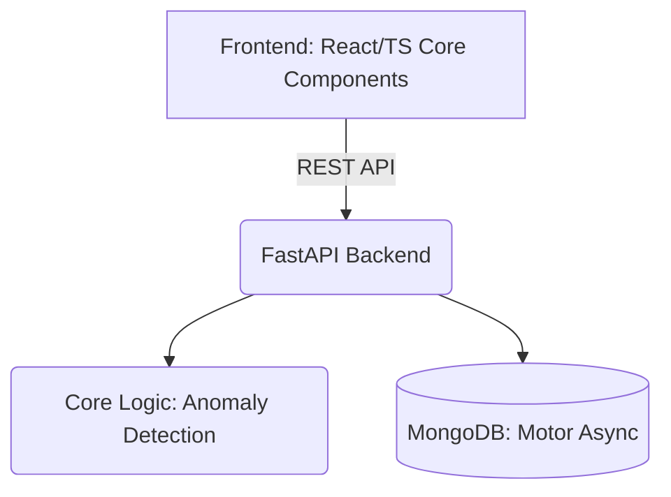

# Dialysis Dashboard

A minimal, practical API and UI intended to help nurses track dialysis sessions and catch potential risks like excessive weight gain or abnormal blood pressure early. 

## Setup Instructions (Under 5 Minutes)

### Prerequisites
- Python 3.9+
- MongoDB (running locally on default port `27017` or update the `.env`)
- Node.js (v18+)

### 1. Clone & Database
Clone this repository and ensure your local MongoDB instance is running.

### 2. Backend Setup
```bash
cd backend
python -m venv venv
# Windows: venv\Scripts\activate | Mac/Linux: source venv/bin/activate
pip install -r requirements.txt
```

### 3. Run the Backend
```bash
# Still in the backend directory
uvicorn src.main:app --reload
```
The API will be available at `http://127.0.0.1:8000`. You can explore the Swagger docs at `http://127.0.0.1:8000/docs`.

### 4. Frontend Status (Where I stopped)
I focused heavily on the API and data layer first to ensure anomalies were detected properly. I created the React components (`CreateSession.tsx`, `SessionList.tsx`) and the API client (`client.ts`), but I **stopped before wiring up a bundler like Vite or Webpack**. 
To actually run these components, you would need to drop them into a scaffolded React app (e.g., `npm create vite@latest`) or finish setting up the build tools in the `frontend` directory.

---

## 🏗️ Architecture Overview

The system uses a classic 3-tier architecture, heavily focused on a robust Python API.



- **Frontend**: Designed with React and TypeScript. Contains the core logic for rendering sessions and forms, but currently missing the scaffolding to serve it.
- **Backend**: Built with FastAPI for high performance and auto-generated OpenAPI docs. It uses `motor` for asynchronous MongoDB operations.
- **Data Layer**: MongoDB is used for flexibility. Sessions are stored with embedded patient references where it makes sense to optimize read performance for "today's schedule".
- **Anomaly Detection**: A module within the backend intercepts incoming session data, checking against configurable thresholds (in `settings.py`) synchronously before saving.

---

## Assumptions and Trade-offs

- **Synchronous Anomaly Detection**: Calculate anomalies synchronously when a session is submitted or updated. *Trade-off*: It marginally increases the API response time for writes, but guarantees that the moment a nurse refreshes the dashboard, the anomaly is visible. Assuming the volume of concurrent session updates per clinic is relatively low, this is perfectly fine.
- **Config-Driven Thresholds**: Clinical values like `min_weight_loss_kg` (2.0) and `high_post_dialysis_systolic_bp_threshold` (140) are defined in `settings.py` (and overrideable via `.env`). I assumed these aren't dynamic per-patient yet, but clinic-wide.
- **Data Modeling Reference vs Embedding**: Keep `patients` and `sessions` in separate collections and use referencing. While embedding sessions into patients makes sense for a single patient view, the primary view for nurses is "Today's Schedule"—querying a standalone `sessions` collection filtered by date is much faster than unwinding every patient document.

---

## Known Limitations & What I Would Do Next

**Where the project stopped:**
The backend is fully capable of registering patients, recording sessions, and successfully flagging anomalies (low weight loss, high BP, abnormal duration). Tests cover these requirements. The frontend components are written but not runnable yet out-of-the-box due to the lack of a bundler.

**What would be next step:**
1. **Finish Frontend Scaffolding**: Setup Vite in the `frontend` folder, add routing (`react-router-dom`), and wire up `App.tsx` to an `index.html` so it can be served.
2. **Patient-Specific Baselines**: Currently, anomaly thresholds are globally defined (e.g., BP > 140). Clinically, a patient's "normal" BP varies. I would update the `Patient` schema to include their specific baseline thresholds and use those in the anomaly service if present, falling back to global defaults.
3. **Database Seeding**: Write a quick Python script to populate MongoDB with fake patient and schedule data to make onboarding smoother. I only got around to testing via Pytest and Swagger so far.
4. **Authentication**: Add JWT-based auth so nurses log in to see only their clinic's schedule. 
